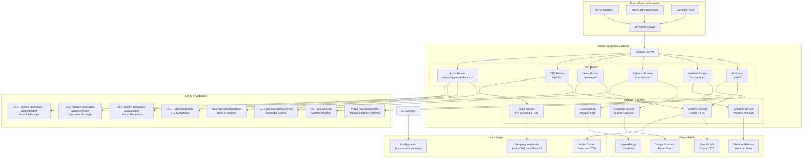

# API Architecture & Service Relationships

```mermaid
graph TB
    subgraph Frontend["React/Electron Frontend"]
        UI[Mirror Interface]
        MOTION[Motion Detection Hook]
        WEBCAM[Webcam Hook]
        API_CLIENT[API Client Service]
    end

    subgraph Backend["Node.js/Express Backend"]
        SERVER[Express Server]

        subgraph Routes["API Routes"]
            AI_ROUTES[AI Routes<br/>/api/ai/*]
            WEATHER_ROUTES[Weather Routes<br/>/api/weather]
            CALENDAR_ROUTES[Calendar Routes<br/>/api/calendar/*]
            NEWS_ROUTES[News Routes<br/>/api/news/*]
            TTS_ROUTES[TTS Routes<br/>/api/tts/*]
            AUDIO_ROUTES[Audio Routes<br/>/api/pre-generated-audio/*]
        end

        subgraph Services["Backend Services"]
            OPENAI_SERVICE[OpenAI Service<br/>Vision + TTS]
            WEATHER_SERVICE[Weather Service<br/>WeatherAPI.com]
            CALENDAR_SERVICE[Calendar Service<br/>Google Calendar]
            NEWS_SERVICE[News Service<br/>NewsAPI.org]
            AUDIO_SERVICE[Audio Service<br/>Pre-generated Files]
        end
    end

    subgraph External["External APIs"]
        OPENAI_API[OpenAI API<br/>Vision + TTS]
        WEATHER_API[WeatherAPI.com<br/>Weather Data]
        GOOGLE_CALENDAR[Google Calendar<br/>Event Data]
        NEWS_API[NewsAPI.org<br/>Headlines]
    end

    subgraph Data["Data Storage"]
        AUDIO_CACHE[Audio Cache<br/>Generated TTS]
        PRE_GENERATED[Pre-generated Audio<br/>Motion/Welcome/Sendoff]
        CONFIG[Configuration<br/>Environment Variables]
    end

    %% Frontend to Backend connections
    UI --> API_CLIENT
    MOTION --> API_CLIENT
    WEBCAM --> API_CLIENT
    API_CLIENT --> SERVER

    %% Backend route connections
    SERVER --> AI_ROUTES
    SERVER --> WEATHER_ROUTES
    SERVER --> CALENDAR_ROUTES
    SERVER --> NEWS_ROUTES
    SERVER --> TTS_ROUTES
    SERVER --> AUDIO_ROUTES

    %% Service connections
    AI_ROUTES --> OPENAI_SERVICE
    WEATHER_ROUTES --> WEATHER_SERVICE
    CALENDAR_ROUTES --> CALENDAR_SERVICE
    NEWS_ROUTES --> NEWS_SERVICE
    TTS_ROUTES --> OPENAI_SERVICE
    AUDIO_ROUTES --> AUDIO_SERVICE

    %% External API connections
    OPENAI_SERVICE --> OPENAI_API
    WEATHER_SERVICE --> WEATHER_API
    CALENDAR_SERVICE --> GOOGLE_CALENDAR
    NEWS_SERVICE --> NEWS_API

    %% Data connections
    OPENAI_SERVICE --> AUDIO_CACHE
    AUDIO_SERVICE --> PRE_GENERATED
    ALL_SERVICES[All Services] --> CONFIG

    %% API Endpoints
    subgraph Endpoints["Key API Endpoints"]
        E1[POST /api/ai/automatic<br/>Motion-triggered Analysis]
        E2[GET /api/weather<br/>Current Weather]
        E3[GET /api/calendar/summary<br/>Calendar Events]
        E4[GET /api/news/headlines<br/>News Headlines]
        E5[GET /api/pre-generated-audio/motion<br/>Motion Response]
        E6[GET /api/pre-generated-audio/welcome<br/>Welcome Message]
        E7[GET /api/pre-generated-audio/sendoff<br/>Sendoff Message]
        E8[POST /api/tts/generate<br/>TTS Generation]
    end

    AI_ROUTES --> E1
    WEATHER_ROUTES --> E2
    CALENDAR_ROUTES --> E3
    NEWS_ROUTES --> E4
    AUDIO_ROUTES --> E5
    AUDIO_ROUTES --> E6
    AUDIO_ROUTES --> E7
    TTS_ROUTES --> E8
```
