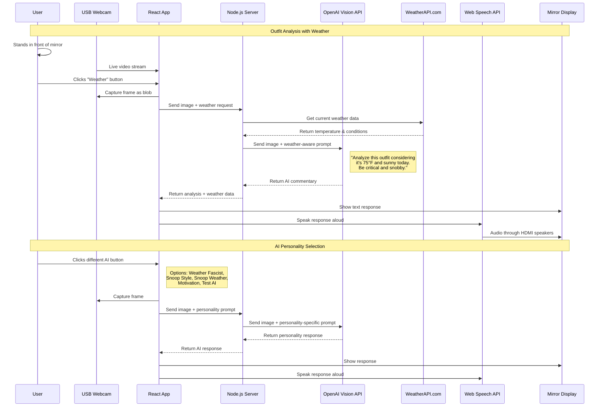

# Data Flow

```mermaid
sequenceDiagram
    participant User
    participant Webcam as USB Webcam
    participant React as React App
    participant Server as Node.js Server
    participant OpenAI as OpenAI Vision API
    participant Weather as WeatherAPI.com
    participant TTS as Web Speech API
    participant Display as Mirror Display

    Note over User,Display: Outfit Analysis with Weather

    User->>User: Stands in front of mirror
    Webcam->>React: Live video stream
    User->>React: Clicks "Weather" button
    React->>Webcam: Capture frame as blob
    React->>Server: Send image + weather request
    Server->>Weather: Get current weather data
    Weather-->>Server: Return temperature & conditions
    Server->>OpenAI: Send image + weather-aware prompt
    Note right of OpenAI: "Analyze this outfit considering<br/>it's 75°F and sunny today.<br/>Be critical and snobby."
    OpenAI-->>Server: Return AI commentary
    Server-->>React: Return analysis + weather data
    React->>Display: Show text response
    React->>TTS: Speak response aloud
    TTS->>Display: Audio through HDMI speakers

    Note over User,Display: AI Personality Selection

    User->>React: Clicks different AI button
    Note right of React: Options: Weather Fascist,<br/>Snoop Style, Snoop Weather,<br/>Motivation, Test AI
    React->>Webcam: Capture frame
    React->>Server: Send image + personality prompt
    Server->>OpenAI: Send image + personality-specific prompt
    OpenAI-->>Server: Return personality response
    Server-->>React: Return AI response
    React->>Display: Show response
    React->>TTS: Speak response aloud
```
