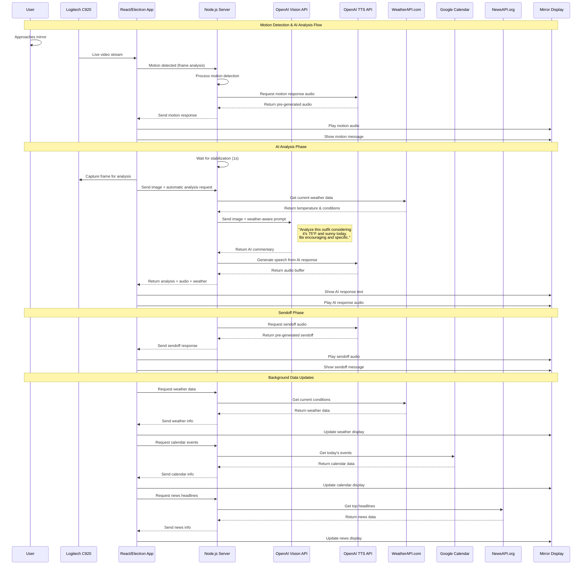

# Data Flow

```mermaid
sequenceDiagram
    participant User
    participant Webcam as Logitech C920
    participant React as React/Electron App
    participant Server as Node.js Server
    participant OpenAI as OpenAI Vision API
    participant TTS as OpenAI TTS API
    participant Weather as WeatherAPI.com
    participant Calendar as Google Calendar
    participant News as NewsAPI.org
    participant Display as Mirror Display

    Note over User,Display: Motion Detection & AI Analysis Flow

    User->>User: Approaches mirror
    Webcam->>React: Live video stream
    React->>Server: Motion detected (frame analysis)
    Server->>Server: Process motion detection
    Server->>TTS: Request motion response audio
    TTS-->>Server: Return pre-generated audio
    Server-->>React: Send motion response
    React->>Display: Play motion audio
    React->>Display: Show motion message

    Note over User,Display: AI Analysis Phase

    Server->>Server: Wait for stabilization (1s)
    React->>Webcam: Capture frame for analysis
    React->>Server: Send image + automatic analysis request
    Server->>Weather: Get current weather data
    Weather-->>Server: Return temperature & conditions
    Server->>OpenAI: Send image + weather-aware prompt
    Note right of OpenAI: "Analyze this outfit considering<br/>it's 75°F and sunny today.<br/>Be encouraging and specific."
    OpenAI-->>Server: Return AI commentary
    Server->>TTS: Generate speech from AI response
    TTS-->>Server: Return audio buffer
    Server-->>React: Return analysis + audio + weather
    React->>Display: Show AI response text
    React->>Display: Play AI response audio

    Note over User,Display: Sendoff Phase

    Server->>TTS: Request sendoff audio
    TTS-->>Server: Return pre-generated sendoff
    Server-->>React: Send sendoff response
    React->>Display: Play sendoff audio
    React->>Display: Show sendoff message

    Note over User,Display: Background Data Updates

    React->>Server: Request weather data
    Server->>Weather: Get current conditions
    Weather-->>Server: Return weather data
    Server-->>React: Send weather info
    React->>Display: Update weather display

    React->>Server: Request calendar events
    Server->>Calendar: Get today's events
    Calendar-->>Server: Return calendar data
    Server-->>React: Send calendar info
    React->>Display: Update calendar display

    React->>Server: Request news headlines
    Server->>News: Get top headlines
    News-->>Server: Return news data
    Server-->>React: Send news info
    React->>Display: Update news display
```
