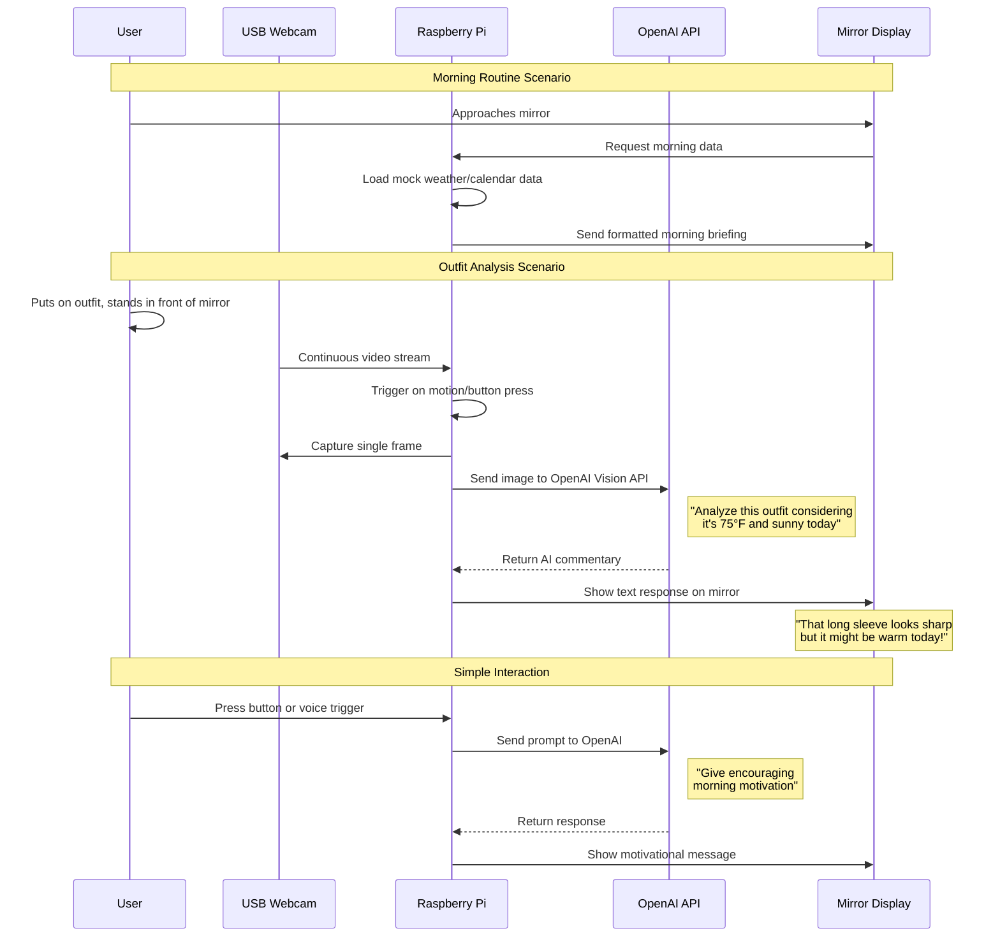

# Data Flow

```mermaid
sequenceDiagram
    participant User
    participant Webcam as USB Webcam
    participant Pi as Raspberry Pi
    participant APIs as OpenAI API
    participant Display as Mirror Display

    Note over User,Display: Morning Routine Scenario

    User->>Display: Approaches mirror
    Display->>Pi: Request morning data
    Pi->>Pi: Load mock weather/calendar data
    Pi->>Display: Send formatted morning briefing

    Note over User,Display: Outfit Analysis Scenario

    User->>User: Puts on outfit, stands in front of mirror
    Webcam->>Pi: Continuous video stream
    Pi->>Pi: Trigger on motion/button press
    Pi->>Webcam: Capture single frame
    Pi->>APIs: Send image to OpenAI Vision API
    Note right of APIs: "Analyze this outfit considering<br/>it's 75°F and sunny today"
    APIs-->>Pi: Return AI commentary
    Pi->>Display: Show text response on mirror
    Note over Display: "That long sleeve looks sharp<br/>but it might be warm today!"

    Note over User,Display: Simple Interaction

    User->>Pi: Press button or voice trigger
    Pi->>APIs: Send prompt to OpenAI
    Note right of APIs: "Give encouraging<br/>morning motivation"
    APIs-->>Pi: Return response
    Pi->>Display: Show motivational message
```
