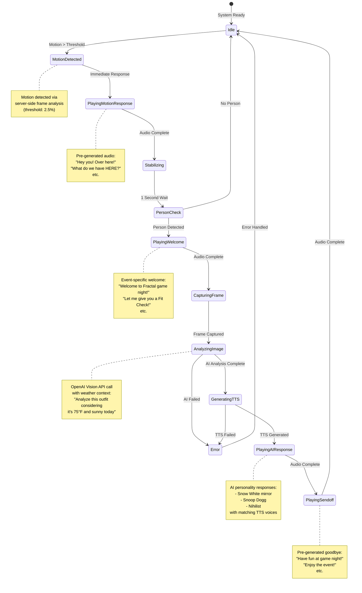

# Motion Detection & AI Interaction Flow

```mermaid
stateDiagram-v2
    [*] --> Idle: System Ready

    Idle --> MotionDetected: Motion > Threshold
    MotionDetected --> PlayingMotionResponse: Immediate Response

    PlayingMotionResponse --> Stabilizing: Audio Complete
    Stabilizing --> PersonCheck: 1 Second Wait

    PersonCheck --> PlayingWelcome: Person Detected
    PersonCheck --> Idle: No Person

    PlayingWelcome --> CapturingFrame: Audio Complete
    CapturingFrame --> AnalyzingImage: Frame Captured

    AnalyzingImage --> GeneratingTTS: AI Analysis Complete
    AnalyzingImage --> Error: AI Failed

    GeneratingTTS --> PlayingAIResponse: TTS Generated
    GeneratingTTS --> Error: TTS Failed

    PlayingAIResponse --> PlayingSendoff: Audio Complete
    PlayingSendoff --> Idle: Audio Complete

    Error --> Idle: Error Handled

    note right of MotionDetected
        Motion detected via
        server-side frame analysis
        (threshold: 2.5%)
    end note

    note right of PlayingMotionResponse
        Pre-generated audio:
        "Hey you! Over here!"
        "What do we have HERE?"
        etc.
    end note

    note right of PlayingWelcome
        Event-specific welcome:
        "Welcome to Fractal game night!"
        "Let me give you a Fit Check!"
        etc.
    end note

    note right of AnalyzingImage
        OpenAI Vision API call
        with weather context:
        "Analyze this outfit considering
        it's 75°F and sunny today"
    end note

    note right of PlayingAIResponse
        AI personality responses:
        - Snow White mirror
        - Snoop Dogg
        - Nihilist
        with matching TTS voices
    end note

    note right of PlayingSendoff
        Pre-generated goodbye:
        "Have fun at game night!"
        "Enjoy the event!"
        etc.
    end note
```
