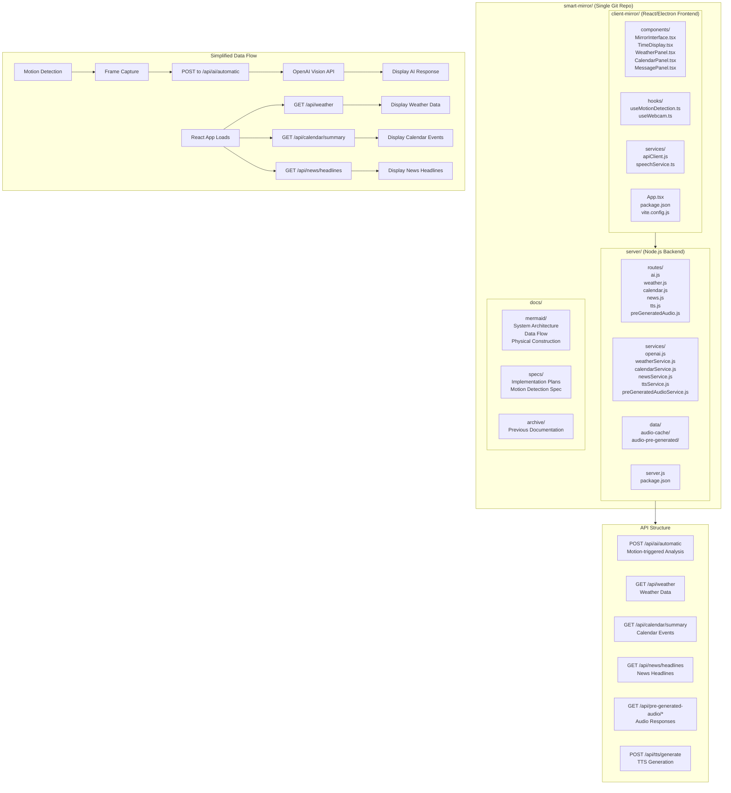

# Repository Structure

```mermaid
graph TB
    subgraph Repo["smart-mirror/ (Single Git Repo)"]
        subgraph Client["client-mirror/ (React/Electron Frontend)"]
            C1[components/<br/>MirrorInterface.tsx<br/>TimeDisplay.tsx<br/>WeatherPanel.tsx<br/>CalendarPanel.tsx<br/>MessagePanel.tsx]
            C2[hooks/<br/>useMotionDetection.ts<br/>useWebcam.ts]
            C3[services/<br/>apiClient.js<br/>speechService.ts]
            C4[App.tsx<br/>package.json<br/>vite.config.js]
        end

        subgraph Server["server/ (Node.js Backend)"]
            S1[routes/<br/>ai.js<br/>weather.js<br/>calendar.js<br/>news.js<br/>tts.js<br/>preGeneratedAudio.js]
            S2[services/<br/>openai.js<br/>weatherService.js<br/>calendarService.js<br/>newsService.js<br/>ttsService.js<br/>preGeneratedAudioService.js]
            S3[data/<br/>audio-cache/<br/>audio-pre-generated/]
            S4[server.js<br/>package.json]
        end

        subgraph Docs["docs/"]
            D1[mermaid/<br/>System Architecture<br/>Data Flow<br/>Physical Construction]
            D2[specs/<br/>Implementation Plans<br/>Motion Detection Spec]
            D3[archive/<br/>Previous Documentation]
        end
    end

    subgraph APIs["API Structure"]
        API1[POST /api/ai/automatic<br/>Motion-triggered Analysis]
        API2[GET /api/weather<br/>Weather Data]
        API3[GET /api/calendar/summary<br/>Calendar Events]
        API4[GET /api/news/headlines<br/>News Headlines]
        API5[GET /api/pre-generated-audio/*<br/>Audio Responses]
        API6[POST /api/tts/generate<br/>TTS Generation]
    end

    subgraph Flow["Simplified Data Flow"]
        F1[Motion Detection] --> F2[Frame Capture]
        F2 --> F3[POST to /api/ai/automatic]
        F3 --> F4[OpenAI Vision API]
        F4 --> F5[Display AI Response]

        F6[React App Loads] --> F7[GET /api/weather]
        F7 --> F8[Display Weather Data]
        F6 --> F9[GET /api/calendar/summary]
        F9 --> F10[Display Calendar Events]
        F6 --> F11[GET /api/news/headlines]
        F11 --> F12[Display News Headlines]
    end

    Client --> Server
    Server --> APIs
```
