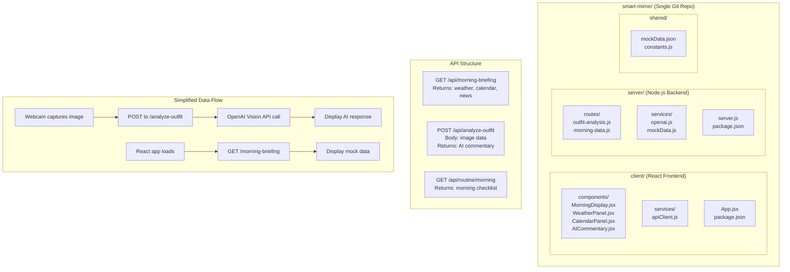

# Repository Structure

```mermaid
graph TB
    subgraph Repo["smart-mirror/ (Single Git Repo)"]
        subgraph Client["client/ (React Frontend)"]
            C1[components/<br/>MorningDisplay.jsx<br/>WeatherPanel.jsx<br/>CalendarPanel.jsx<br/>AICommentary.jsx]
            C2[services/<br/>apiClient.js]
            C3[App.jsx<br/>package.json]
        end

        subgraph Server["server/ (Node.js Backend)"]
            S1[routes/<br/>outfit-analysis.js<br/>morning-data.js]
            S2[services/<br/>openai.js<br/>mockData.js]
            S3[server.js<br/>package.json]
        end

        subgraph Shared["shared/"]
            SH1[mockData.json<br/>constants.js]
        end
    end

    subgraph APIs["API Structure"]
        API1[GET /api/morning-briefing<br/>Returns: weather, calendar, news]
        API2[POST /api/analyze-outfit<br/>Body: image data<br/>Returns: AI commentary]
        API3[GET /api/routine/morning<br/>Returns: morning checklist]
    end

    subgraph Flow["Simplified Data Flow"]
        F1[Webcam captures image] --> F2[POST to /analyze-outfit]
        F2 --> F3[OpenAI Vision API call]
        F3 --> F4[Display AI response]

        F5[React app loads] --> F6[GET /morning-briefing]
        F6 --> F7[Display mock data]
    end
```
