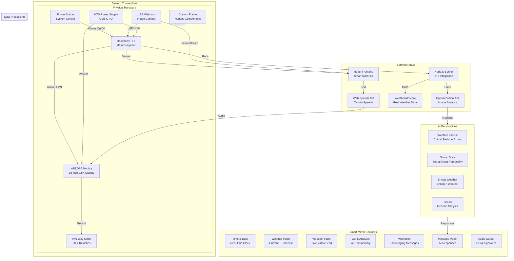

# System Architecture

```mermaid
graph TB
    subgraph Hardware["Physical Hardware"]
        RP[Raspberry Pi 5<br/>Main Computer]
        MON[ARZOPA Monitor<br/>16 inch 2.5K Display]
        MIRROR[Two-Way Mirror<br/>20 x 16 inches]
        WEBCAM[USB Webcam<br/>Image Capture]
        FRAME[Custom Frame<br/>Houses Components]
        PWR[60W Power Supply<br/>USB-C PD]
        BTN[Power Button<br/>System Control]
    end

    subgraph Software["Software Stack"]
        REACT[React Frontend<br/>Smart Mirror UI]
        SERVER[Node.js Server<br/>API Integration]
        OPENAI[OpenAI Vision API<br/>Image Analysis]
        WEATHER_API[WeatherAPI.com<br/>Real Weather Data]
        TTS[Web Speech API<br/>Text-to-Speech]
    end

    subgraph Features["Smart Mirror Features"]
        TIME[Time & Date<br/>Real-time Clock]
        WEATHER[Weather Panel<br/>Current + Forecast]
        WEBCAM_UI[Webcam Panel<br/>Live Video Feed]
        OUTFIT[Outfit Analysis<br/>AI Commentary]
        MOTIVATION[Motivational Messages<br/>AI Generated]
        MESSAGE[Message Panel<br/>AI Responses]
        TTS_OUT[Audio Output<br/>HDMI Speakers]
    end

    subgraph Connections["System Connections"]
        BTN -->|Power On/Off| RP
        RP -->|micro HDMI| MON
        MON -->|Behind| MIRROR
        WEBCAM -->|USB| RP
        PWR -->|Powers| RP
        PWR -->|Powers| MON
        FRAME -->|Houses All| Hardware
    end

    subgraph Processing["Data Processing"]
        RP -->|Serves| REACT
        RP -->|Runs| SERVER
        SERVER -->|Calls| OPENAI
        SERVER -->|Calls| WEATHER_API
        WEBCAM -->|Video Stream| REACT
        REACT -->|Text| TTS
        TTS -->|Audio| MON
    end

    subgraph AI_Personalities["AI Personalities"]
        WEATHER_FASCIST[Weather Fascist<br/>Critical Fashion Expert]
        SNOOP_STYLE[Snoop Style<br/>Snoop Dogg Personality]
        SNOOP_WEATHER[Snoop Weather<br/>Snoop + Weather]
        MOTIVATION[Motivation<br/>Encouraging Messages]
        TEST_AI[Test AI<br/>Generic Analysis]
    end

    OPENAI -->|Analyzes| AI_Personalities
    AI_Personalities -->|Responses| MESSAGE
```
