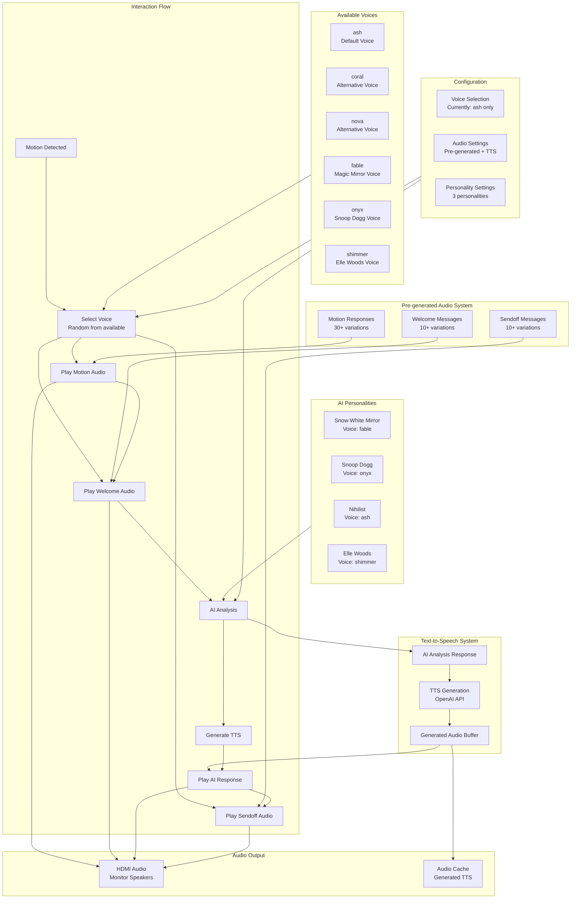

# Voice System & Audio Flow

```mermaid
graph TB
    subgraph Voices["Available Voices"]
        ASH[ash<br/>Default Voice]
        CORAL[coral<br/>Alternative Voice]
        NOVA[nova<br/>Alternative Voice]
        FABLE[fable<br/>Magic Mirror Voice]
        ONYX[onyx<br/>Snoop Dogg Voice]
        SHIMMER[shimmer<br/>Elle Woods Voice]
    end

    subgraph PreGenerated["Pre-generated Audio System"]
        MOTION_AUDIO[Motion Responses<br/>30+ variations]
        WELCOME_AUDIO[Welcome Messages<br/>10+ variations]
        SENDOFF_AUDIO[Sendoff Messages<br/>10+ variations]
    end

    subgraph TTS["Text-to-Speech System"]
        AI_RESPONSE[AI Analysis Response]
        TTS_GENERATION[TTS Generation<br/>OpenAI API]
        TTS_AUDIO[Generated Audio Buffer]
    end

    subgraph Interaction["Interaction Flow"]
        MOTION_DETECTED[Motion Detected]
        SELECT_VOICE[Select Voice<br/>Random from available]
        PLAY_MOTION[Play Motion Audio]
        PLAY_WELCOME[Play Welcome Audio]
        AI_ANALYSIS[AI Analysis]
        GENERATE_TTS[Generate TTS]
        PLAY_AI[Play AI Response]
        PLAY_SENDOFF[Play Sendoff Audio]
    end

    subgraph Audio["Audio Output"]
        HDMI_AUDIO[HDMI Audio<br/>Monitor Speakers]
        AUDIO_CACHE[Audio Cache<br/>Generated TTS]
    end

    %% Voice selection
    Voices --> SELECT_VOICE
    SELECT_VOICE --> PLAY_MOTION
    SELECT_VOICE --> PLAY_WELCOME
    SELECT_VOICE --> PLAY_SENDOFF

    %% Pre-generated audio flow
    MOTION_AUDIO --> PLAY_MOTION
    WELCOME_AUDIO --> PLAY_WELCOME
    SENDOFF_AUDIO --> PLAY_SENDOFF

    %% TTS flow
    AI_ANALYSIS --> AI_RESPONSE
    AI_RESPONSE --> TTS_GENERATION
    TTS_GENERATION --> TTS_AUDIO
    TTS_AUDIO --> PLAY_AI

    %% Interaction sequence
    MOTION_DETECTED --> SELECT_VOICE
    PLAY_MOTION --> PLAY_WELCOME
    PLAY_WELCOME --> AI_ANALYSIS
    AI_ANALYSIS --> GENERATE_TTS
    GENERATE_TTS --> PLAY_AI
    PLAY_AI --> PLAY_SENDOFF

    %% Audio output
    PLAY_MOTION --> HDMI_AUDIO
    PLAY_WELCOME --> HDMI_AUDIO
    PLAY_AI --> HDMI_AUDIO
    PLAY_SENDOFF --> HDMI_AUDIO
    TTS_AUDIO --> AUDIO_CACHE

    %% Voice personality mapping
    subgraph Personalities["AI Personalities"]
        SNOW_WHITE[Snow White Mirror<br/>Voice: fable]
        SNOOP_DOGG[Snoop Dogg<br/>Voice: onyx]
        NIHILIST[Nihilist<br/>Voice: ash]
        ELLE_WOODS[Elle Woods<br/>Voice: shimmer]
    end

    Personalities --> AI_ANALYSIS

    %% Configuration
    subgraph Config["Configuration"]
        VOICE_CONFIG[Voice Selection<br/>Currently: ash only]
        AUDIO_CONFIG[Audio Settings<br/>Pre-generated + TTS]
        PERSONALITY_CONFIG[Personality Settings<br/>3 personalities]
    end

    Config --> SELECT_VOICE
    Config --> AI_ANALYSIS
```
