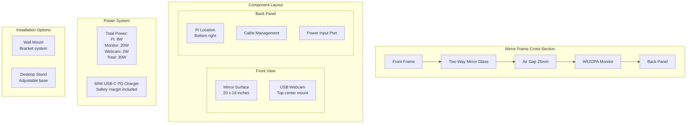

# Physical Construction

```mermaid
graph TB
    subgraph Frame["Mirror Frame Cross-Section"]
        F1[Front Frame]
        F2[Two-Way Mirror Glass]
        F3[Air Gap 25mm]
        F4[ARZOPA Monitor]
        F5[Back Panel]
    end

    subgraph Layout["Component Layout"]
        subgraph Front["Front View"]
            MIRROR_VIEW[Mirror Surface<br/>20 x 16 inches]
            WEBCAM_MOUNT[USB Webcam<br/>Top center mount]
        end

        subgraph Back["Back Panel"]
            PI_LOCATION[Pi Location<br/>Bottom right]
            CABLE_ROUTE[Cable Management]
            POWER_IN[Power Input Port]
        end
    end

    subgraph Power["Power System"]
        POWER_DRAW[Total Power:<br/>Pi: 8W<br/>Monitor: 20W<br/>Webcam: 2W<br/>Total: 30W]
        POWER_SUPPLY[60W USB-C PD Charger<br/>Safety margin included]
    end

    subgraph Mounting["Installation Options"]
        WALL_OPTION[Wall Mount<br/>Bracket system]
        DESK_OPTION[Desktop Stand<br/>Adjustable base]
    end

    F1 --> F2
    F2 --> F3
    F3 --> F4
    F4 --> F5
```
