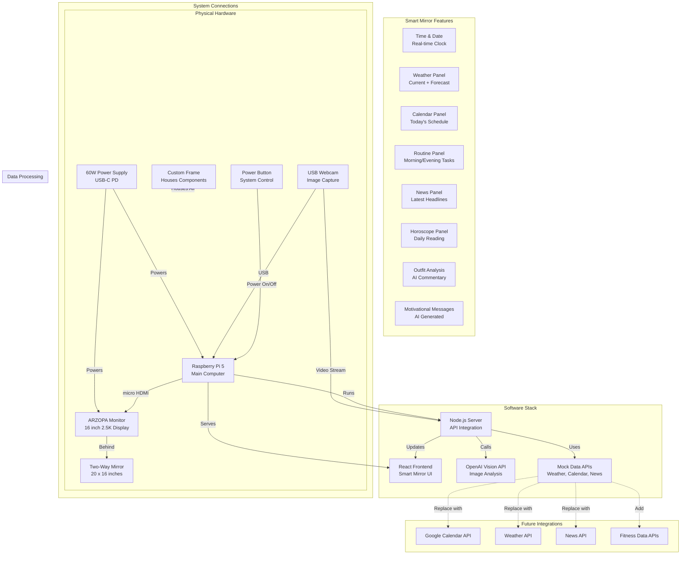

# System Architecture

```mermaid
graph TB
    subgraph Hardware["Physical Hardware"]
        RP[Raspberry Pi 5<br/>Main Computer]
        MON[ARZOPA Monitor<br/>16 inch 2.5K Display]
        MIRROR[Two-Way Mirror<br/>20 x 16 inches]
        WEBCAM[USB Webcam<br/>Image Capture]
        FRAME[Custom Frame<br/>Houses Components]
        PWR[60W Power Supply<br/>USB-C PD]
        BTN[Power Button<br/>System Control]
    end

    subgraph Software["Software Stack"]
        REACT[React Frontend<br/>Smart Mirror UI]
        SERVER[Node.js Server<br/>API Integration]
        OPENAI[OpenAI Vision API<br/>Image Analysis]
        MOCK[Mock Data APIs<br/>Weather, Calendar, News]
    end

    subgraph Features["Smart Mirror Features"]
        TIME[Time & Date<br/>Real-time Clock]
        WEATHER[Weather Panel<br/>Current + Forecast]
        CALENDAR[Calendar Panel<br/>Today's Schedule]
        ROUTINE[Routine Panel<br/>Morning/Evening Tasks]
        NEWS[News Panel<br/>Latest Headlines]
        HOROSCOPE[Horoscope Panel<br/>Daily Reading]
        OUTFIT[Outfit Analysis<br/>AI Commentary]
        MOTIVATION[Motivational Messages<br/>AI Generated]
    end

    subgraph Connections["System Connections"]
        BTN -->|Power On/Off| RP
        RP -->|micro HDMI| MON
        MON -->|Behind| MIRROR
        WEBCAM -->|USB| RP
        PWR -->|Powers| RP
        PWR -->|Powers| MON
        FRAME -->|Houses All| Hardware
    end

    subgraph Processing["Data Processing"]
        RP -->|Serves| REACT
        RP -->|Runs| SERVER
        SERVER -->|Calls| OPENAI
        SERVER -->|Uses| MOCK
        WEBCAM -->|Video Stream| SERVER
        SERVER -->|Updates| REACT
    end

    subgraph Future["Future Integrations"]
        GOOGLE[Google Calendar API]
        WEATHER_API[Weather API]
        NEWS_API[News API]
        FITNESS[Fitness Data APIs]
    end

    MOCK -.->|Replace with| GOOGLE
    MOCK -.->|Replace with| WEATHER_API
    MOCK -.->|Replace with| NEWS_API
    MOCK -.->|Add| FITNESS
```
